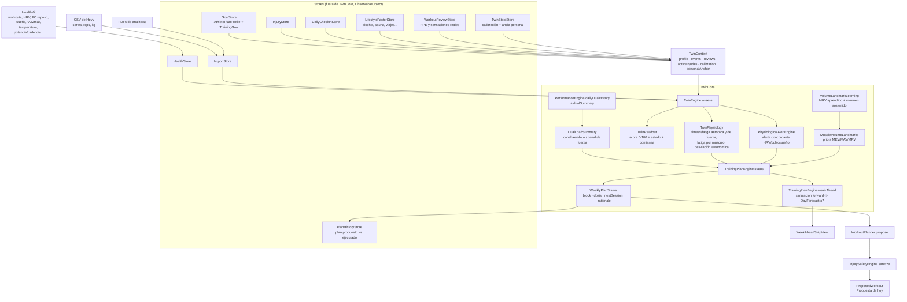

# EterHealth (éter)

Gemelo digital **personal** de performance y wellness para atleta híbrido
(fuerza + endurance). App iOS + Apple Watch + widgets, SwiftUI, HealthKit,
sin dependencias externas.

No es un producto multiusuario ni comercial: es una sola app, para un solo
atleta, y varias decisiones de diseño sólo tienen sentido leídas así. En
particular **no hay** —ni debe añadirse— lógica de ciclo menstrual, de
género ni de segmentación por población.

El principio que gobierna todo el motor: **cero invención de datos**. Cuando
no hay evidencia real (una zona de FC medida, una tirada larga previa, un MRV
aprendido), éter usa un prior documentado y lo dice, o se calla. Nunca
rellena el hueco con un número inventado que parezca personal.

---

## 1. Estructura del repo

```
EterHealth/                     app iOS (SwiftUI) — vistas, stores, motores de dominio
EterHealth/TwinCore/            el motor del gemelo (ver abajo)
EterHealthTests/                XCTest — EngineTests.swift (unitarios) + LabImportRealPDFTests
EterHealthWatch Watch App/      app de reloj (registro de series y métricas en vivo)
EterHealthWidgets/              widgets de pantalla de inicio
```

Cuatro targets (`EterHealth`, `EterHealthTests`, `EterHealthWatch Watch App`,
`EterHealthWidgets`), Xcode 26.3, Swift 6 (el target de iOS aún compila en
modo Swift 5), iOS 18.0+, watchOS 26.2+. **Sin SPM, sin CocoaPods.**

`TwinCore/` es la frontera importante: todo lo que decide *qué entrenar* vive
ahí y **no lee singletons**. Recibe los datos por parámetro (ver
[`TwinContext`](#7-convenciones-de-código)). Los stores, las vistas y
`WorkoutPlanner` viven fuera.

---

## 2. Arquitectura de alto nivel



### Las cuatro piezas que importan

| Pieza | Pregunta que responde | Devuelve |
|---|---|---|
| `TwinEngine.assess` | *¿Cómo estoy hoy?* | `TwinAssessment` (score, señales, músculos, `TwinPhysiology`, `TwinReadout`, alerta, predicción de mañana) |
| `TrainingPlanEngine.status` | *¿Qué toca hoy y por qué?* | `WeeklyPlanStatus` (bloque/fase, dosis por disciplina, `nextSession: PlannedSessionKind`, `rationale`) |
| `TrainingPlanEngine.weekAhead` | *¿Y el resto de la semana?* | `[DayForecast]` — simulación hacia delante con `step()` |
| `WorkoutPlanner.propose` | *¿Qué hago exactamente?* | `ProposedWorkout` (ejercicios, prescripción, cues) |

`TwinEngine.assess` llama internamente a `TrainingPlanEngine.status` para
que `recommendation` y el plan nunca puedan discrepar. `WorkoutPlanner`
también llama a `status` para leer la estructura completa del plan (fase,
progreso, dosis), no sólo el texto.

Motores auxiliares que cuelgan de aquí, cada uno con su ámbito:
`RunningPerformanceEngine` (VDOT/Riegel, cobertura, distribución de zonas),
`HyroxForecastEngine`, `TriathlonForecastEngine`, `PerformanceEngine`
(historial dual y `LoadGuidance`), `StrengthPrescriptionEngine` (rangos de
reps por objetivo), `StrengthProgressEngine` (1RM estimado y frescura por
lift), `PersonalBaselineEngine` (líneas base personales por métrica),
`ConfidenceEngine`, `DecisionSimulatorEngine` / `TrainingScenarioEngine`
("Tres futuros"), `InjurySafetyEngine`, `SleepArchitectureEngine`,
`SleepRegularityEngine`, `BiologicalAgeEngine`, `LongevityEngine`,
`EnduranceNutritionEngine`, `CaffeinePharmacokinetics`.

---

## 3. Cómo se genera un plan de entrenamiento

### 3.1 Periodización: bloques y fases

`TrainingPlanEngine.blocks(for:)` construye la periodización alrededor de los
**eventos primarios con fecha** del perfil (`primaryEvents(for:)`: prioridad
`.primary` si hay alguno, si no cualquier objetivo con fecha, ordenados por
fecha). Para el primer evento:

| Bloque | `TrainingPhase` | Ventana relativa al evento |
|---|---|---|
| `Base para <evento>` | `.base` | D-84 → D-43 |
| `Construcción específica` | `.buildSpecific` | D-42 → D-14 |
| `Afinamiento · <evento>` | `.taper` | D-13 → D-1 |
| `<evento>` | `.race` | el día |

Cada evento posterior añade `Transición a <evento>` (`.transition`),
afinamiento y día de carrera. **Sin ningún evento con fecha** se usa
`generalBlock` → `Desarrollo híbrido`, fase `.base`, con los rangos de
sesiones repartidos según `goalFocus`.

Cada `TrainingBlock` lleva `runningSessions`/`strengthSessions`/
`qualitySessions` como rangos, y `progress(on:)` — 0 el primer día del
bloque, 1 el último. Ese `progress` es lo que hace que la semana 1 de un
bloque de 6 semanas no prescriba lo mismo que la semana 6:
`WorkoutPlanner.ramp(min, max, progress)` interpola dentro de las bandas de
fase (`longRunBand`, `easyRunBand`, `swimBand`, `bikeBand`...).

`goalFocus(for:on:)` convierte los objetivos activos en pesos normalizados
`running / strength / hybrid / triathlon`, ponderando prioridad
(`primary` 3, `secondary` 2, `maintenance` 1) por proximidad del evento
(×1.65 a ≤14 días, ×1.40 a ≤42, ×1.18 a ≤84, ×1.0 más allá). HYROX reparte
0.35/0.35/0.30; triatlón/Ironman 0.30 running / 0.15 fuerza / 0.55 triatlón.

### 3.2 Dual-load: dos canales, no una mezcla

`PerformanceEngine.dailyDualHistory` separa el historial diario en **canal
aeróbico** y **canal de fuerza** en el origen (Hevy es fuerza por
definición: series × 3; HealthKit se valora por minutos × `cardioFactor`, y
una sesión de fuerza registrada en HealthKit cae en el canal de fuerza).
`dualSummary` calcula por canal:

- **agudo** τ = 7 días, **habitual** τ = 28 días (EWMA semanal-equivalente)
- `governingRatio` = `max(ratioAeróbico, ratioFuerza)` — manda el canal que
  pica, no el promedio
- `guidance` = la `LoadGuidance` del canal con más cautela
  (`learning < low < productive < absorb < deload < overload`)
- Suelo de confianza `DualLoad.minimumTrustedHabitual = 15`: por debajo de
  eso un canal no tiene ratio con el que juzgar nada (evita mandar a
  recuperación permanente a quien empieza una disciplina nueva)

`TwinPhysiology` es el vector de estado, con τ separadas por canal:
fitness aeróbica τ≈42 / fatiga aeróbica τ≈7; fitness de fuerza τ≈28 /
fatiga de fuerza τ≈5. La función pura `step(state, session, recoverySignals,
dtDays)` es el **único** sitio por el que pasan tanto la predicción de mañana
de `TwinStateStore` como la simulación de `weekAhead`, para que no puedan
divergir.

### 3.3 Landmarks de volumen MEV / MAV / MRV

`MuscleVolumeLandmarkTable.landmarks(for:learned:sustained:)` da **series
directas semanales** por grupo muscular (10 grupos, los mismos nombres que
`MuscleReadiness`). El MAV es un **prior** de tabla, situado en la banda de
~10–20 series/músculo/semana que describen los meta-análisis de
dosis-respuesta de volumen para intermedios; MEV = 0.5 × MAV y
MRV = 1.5 × MAV son ratios fijos.

Dos cosas se individualizan, y sólo desde datos reales de entrenamiento:

- **MRV aprendido** — `VolumeLandmarkLearning.learnedMRV` estima la frontera
  por encima de la cual el e1RM de este atleta se estanca. Cuando existe,
  manda sobre el prior. Exige 8 semanas con volumen, 5 juzgables, 3 de cada
  clase, y que las semanas estancadas lleven de verdad más volumen que las
  que progresaron; si no, no afirma nada.
- **Ajuste de tolerancia del MAV** — `sustainedWeeklySets` mide (mediana de
  12 semanas) cuánto volumen sostiene realmente en cada músculo, y el MAV se
  mueve a medio camino entre el prior y esa realidad, **acotado a ±25 %** del
  prior. Es un empujón del prior, no un landmark aprendido. Los tres
  landmarks se mueven con él.

Los dos llegan juntos en un `VolumeLandmarkContext`, y el MRV aprendido se
acota contra el prior **puro** para que el empujón y el aprendizaje no se
amplifiquen mutuamente.

El tren inferior se queda deliberadamente en el extremo **bajo** de la
banda: `recentSets` cuenta series de resistencia (Hevy), así que el estímulo
real que la carrera y la bici dan a cuádriceps/glúteos/isquios/gemelos es
invisible para estos landmarks. Bíceps, tríceps y core también, porque
`MuscleMap.involvement` ya acredita trabajo indirecto ponderado y pedir la
banda alta de series *directas* encima de ese crédito contaría dos veces.
La cabecera de `MuscleVolumeLandmarks.swift` documenta el origen de cada
número y la tabla de antes/después.

Se usan en `volumeUrgency`, que empuja la elección de patrón de fuerza:
por debajo de MEV → +25 (déficit real), MEV–MAV → +10, MAV–MRV → −10,
por encima de MRV → −25. La urgencia **nunca** rescata a un grupo
genuinamente fatigado: `bestStrengthPattern` exige readiness ≥ 50.

### 3.4 La decisión del día

`TrainingPlanEngine.status` evalúa en **orden de prioridad estricto**. El
primero que dispara gana:

1. **Override fisiológico duro** — `checkIn.illness`, `readiness < 42`, o
   `PhysiologicalAlert.severity == .recover` → `.recovery`.
   *"Tus señales actuales tienen prioridad sobre el calendario."*
2. **Evento hoy** → `.raceDay` (protocolo de competición, nunca un
   entrenamiento).
3. **Carrera ya hecha hoy** → `.recovery`, o `.strength` de tren superior si
   queda cuota y readiness ≥ 68.
4. **Cualquier sesión real ya hecha hoy** → `.recovery`.
5. **Techo de ratio del ritmo de progresión** — `exceedsPaceCeiling`
   (`ProgressionPace.ratioCeiling`: conservador 1.30 / óptimo 1.55 /
   agresivo 1.80) → `.recovery`.
6. **Ventana de recuperación de la última sesión clave** — tirada larga
   < 36 h, calidad < 24 h → `.recovery`.
7. **Carga real en 3 días de las últimas 72 h** → `.recovery`.
8. **Suelo de readiness del ritmo** (`readinessFloor`: 64 / 58 / 50) →
   `.recovery`.
9. **`balancedDecision`** — el caso normal: reparte entre déficit de
   sesiones y de minutos por disciplina, días desde la última fuerza, dosis
   de lifts trackeados, frescura muscular, interferencia concurrente,
   distribución de intensidad reciente y `goalFocus`.

Después de elegir, tres ajustes, en este orden:

1. **Alerta `.caution`**: si el resultado era `.qualityRun`, `.longRun`,
   `.hybrid` o `.brick`, se sustituye por `.easyRun` y se dice por qué. La
   fuerza no se toca (su propio factor de carga por readiness ya modera).
2. **Veto por lesión**: `InjurySafetyEngine.allows(_:injuries:)` y
   `allowedPatterns(injuries:)` son la única definición de qué bloquea cada
   restricción activa. Un kind bloqueado pasa a `.recovery`; un patrón de
   fuerza bloqueado se sustituye por el mejor compatible, y si no queda
   ninguno el día pasa a `.recovery`. Va después del punto 1 porque esa
   sustitución puede producir una carrera suave, que también puede estar
   restringida. El `nextSession` que sale de `status` ya es compatible: el
   motor y la UI no pueden discrepar.
3. **Divulgación de riesgo de Agresivo**: si hoy no es recuperación sólo
   porque el techo 1.80 lo tolera donde 1.55 ya habría parado, se dice
   explícitamente en el `rationale`.

Cuando el día es de fuerza, `status` elige además **un solo**
`StrengthPattern` (pierna / empuje / tirón) y lo publica en
`WeeklyPlanStatus.strengthPattern`. `TrainingPlanEngine.strengthPattern(...)`
resuelve en orden: restricciones por lesión → `avoidLegs` por interferencia
concurrente → un lift trackeado vencido (≥10 días, si su grupo está ≥55) →
frescura + urgencia de volumen. Es el mismo patrón que se muestra y el que
se entrena.

**Deload**: `loadSummary.dual.guidance == .deload` y ningún evento hoy →
`isDeload`. Recorta ~30 % los objetivos de sesiones
(`deloadAdjustment` para carrera/fuerza/calidad; ×0.70 para natación, bici y
las dosis en minutos) y elimina la calidad no imprescindible.

**Interferencia concurrente** (`concurrentInterference`): salta sólo si el
canal aeróbico pide absorber **y** el día pediría fuerza de pierna. Se
canaliza por el mecanismo que ya existía —quitar la pierna del patrón de
fuerza (`avoidLegs`)— no por una vía paralela.
`legSensitiveRunLikelyTomorrow` añade la mitad prospectiva: "¿mañana quiere
piernas frescas?", respondida sólo con tiempo transcurrido, día de la semana
y `goalFocus`, sin simular mañana.

### 3.5 De la decisión a la sesión concreta

`WorkoutPlanner.propose` construye la sesión a partir de la
`PlannedSessionKind` del plan y de su estructura (fase, `progress`, dosis,
`isDeload`, `volumeFactor`), y luego pasa el resultado por
`InjurySafetyEngine.sanitize`, que retira ejercicios incompatibles con las
restricciones activas o sustituye la sesión entera por una alternativa
compatible.

Los techos de volumen se personalizan con `progressedCeiling`: la banda de
fase pone la ambición, pero el techo real de hoy también está limitado por
la propia sesión más larga reciente del atleta **más** la tasa de
crecimiento semanal de su `ProgressionPace` (4 % / 9 % / 15 %). Cuando eso
ha ocurrido, el `note` de la sesión lo dice.

---

## 4. Dependencias de datos

### Obligatorio para que el plan sea real

- **HealthKit — workouts** (`HKObjectType.workoutType()`): la base de todo.
  Sin historial de entrenamientos no hay carga, ni ratio, ni cobertura.

### HealthKit — lectura (todo opcional; cada hueco degrada una función concreta)

| Grupo | Identificadores | Sin ellos |
|---|---|---|
| Autonómico | `heartRateVariabilitySDNN`, `restingHeartRate`, `walkingHeartRateAverage`, `heartRateRecoveryOneMinute` | no hay alerta fisiológica concordante ni desviación autonómica en el vector de estado |
| Cardio | `heartRate`, `vo2Max`, `activeEnergyBurned`, `appleExerciseTime` | no hay zonas reales ni clasificación de calidad por FC |
| Distancia | `distanceWalkingRunning`, `distanceCycling`, `distanceSwimming` | bici y piscina pierden `distanceKilometers` → no hay ritmo personal, se cae al estimador estructural |
| Sueño | `sleepAnalysis` | no hay deuda de sueño, arquitectura ni regularidad |
| Composición | `bodyMass`, `bodyFatPercentage`, `leanBodyMass` | no hay tendencia de composición ni edad biológica completa |
| Clínico | `bloodPressureSystolic/Diastolic`, `respiratoryRate`, `oxygenSaturation`, `electrocardiogramType` | secciones clínicas vacías |
| Temperatura | `appleSleepingWristTemperature` | no hay desviación de temperatura |
| Dinámica de carrera | `runningPower`, `runningGroundContactTime`, `runningVerticalOscillation`, `runningStrideLength` | sin métricas de eficiencia |
| Ciclismo | `cyclingPower`, `cyclingCadence` | sin potencia/cadencia reales |
| Estilo de vida | `numberOfAlcoholicBeverages`, `stepCount` | señal de alcohol y de actividad diaria ausentes |

### HealthKit — escritura

`workoutType()`, `numberOfAlcoholicBeverages`, `bodyMass`,
`bodyFatPercentage`, `leanBodyMass` (sesiones propias de éter y del reloj,
registro de alcohol, composición corporal).

### Importado a mano (`ImportStore.importFiles`)

- **`.csv` de Hevy** → `ImportedWorkout` con series, reps y kg. Es la única
  fuente de **volumen por serie** real; HealthKit sólo da minutos. Una
  reimportación **enriquece** sesiones ya guardadas (mismo `id`), no las
  duplica.
- **`.pdf` de analíticas** → `LabResult`. Ver `LabCategory` y
  `LabImportRealPDFTests`.

`isHealthKitMirror` desduplica: una sesión de Hevy que también aparece
espejada en HealthKit se cuenta una sola vez.

### Entrada manual (opcional, pero cambia el plan)

`AthletePlanProfile`: objetivos y fechas, `gymAvailable`,
`trainingDaysPerWeek`, `preferredLongRunWeekday`, `maximumHeartRate`,
`birthDate`, `manualHeartRateZones` (test de lactato — manda sobre la
estimación), `progressionPace`. Además: check-in diario, lesiones activas
con restricciones, factores de estilo de vida, y reviews de sesión (RPE
real), que es lo que permite clasificar calidad por evidencia en vez de por
kcal/min.

---

## 5. Limitaciones conocidas

Están documentadas en el código, en el sitio donde ocurren. Resumen:

1. **MEV/MAV/MRV no son individuales por experiencia, edad ni
   antropometría.** El MAV es un prior de tabla y MEV/MRV se derivan con
   ratios fijos 0.5× / 1.5×; la literatura describe espaciados de landmark
   que varían músculo a músculo. Lo único que individualiza es lo que sale
   del propio historial de entrenamiento (MRV aprendido y ajuste de
   tolerancia del MAV, ±25 %), y no se intenta derivarlos de edad o tamaño
   corporal: esta app no puede medir "años de entrenamiento efectivo", y la
   evidencia para escalar landmarks por esas variables es mucho más débil
   que la que sostiene la banda de 10–20.
2. **El estímulo de pierna del cardio no cuenta hacia los landmarks.**
   `recentSets` sale de las series de Hevy; una tirada larga no aparece ahí.
   Los priors de tren inferior están calibrados a la baja precisamente por
   eso, pero es una compensación de tabla, no una medición.
3. **τ fijas.** 42/7 (aeróbico) y 28/5 (fuerza) días son la misma heurística
   Banister-style que ya usaba `TrainingScenarioEngine`, partida en dos
   canales. No se ajustan por atleta.
4. **El reparto aeróbico/fuerza de una sesión mixta es heurístico**:
   `DualLoad.split` da 0.6/0.4 a híbrido y brick. No sale de medición.
5. **`forecastSessionLoad` es estructural, no personal.** No hay forma de
   partir el historial de alguien por tipo de sesión *planificada*, así que
   la carga estimada por `PlannedSessionKind` es una tabla, no un ajuste.
6. **La dosis de carrera no se escala por distancia objetivo** en
   `status` (sí en `WorkoutPlanner`, que es donde sale la prescripción real).
   Es una señal secundaria de ponderación, y duplicar ahí la resolución de
   `targetKilometers` no compensa.
7. **La dosis de brick no tiene techo personal**: no existe una actividad
   HealthKit única "brick" contra la que medir "el brick más largo
   reciente".
8. **`weekAhead` congela varias entradas** a su valor de hoy durante toda la
   ventana simulada (readiness, `hoursSince*`, y la semilla de `recentSets`
   no rueda fuera de su ventana de 7 días). Es una simplificación asumida y
   comentada, no un descuido.
9. **El ratio agudo:crónico que gobierna el gate** sigue viviendo en el EWMA
   de un solo canal combinado dentro de `ForwardState`, no en los dos
   canales de `DualLoad`.
10. **`MuscleMap` hace matching de substrings en inglés** (la convención de
   los exports de Hevy). Nombres en español caen al bucket genérico.
11. **`LabImportRealPDFTests` se salta** si `/tmp/eter-lab-pdfs` está vacío
    (macOS purga `/tmp`). No es un fallo: es un skip explícito.

---

## 6. Build y tests

```bash
xcodebuild build -scheme EterHealth -destination 'platform=iOS Simulator,name=iPhone 17 Pro'
```

```bash
xcodebuild test -scheme EterHealth -destination 'platform=iOS Simulator,name=iPhone 17 Pro'
```

**No uses `-quiet`**: se traga los fallos y deja sólo `** TEST FAILED **`
sin decir qué test ni por qué.

Los tests son `EterHealthTests/EngineTests.swift` — unitarios puros que
construyen `HealthStore`/`ImportStore`/`TwinContext` a mano e inyectan `now`,
sin UI y sin HealthKit real. `LabImportRealPDFTests` lee PDFs reales desde
`/tmp/eter-lab-pdfs` y se salta si no están.

Filtrar un test concreto:

```bash
xcodebuild test -scheme EterHealth -destination 'platform=iOS Simulator,name=iPhone 17 Pro' -only-testing:EterHealthTests/EngineTests/testNombreDelTest
```

---

## 7. Convenciones de código

**Comentarios que explican el *por qué*, no el *qué*.** Es la convención más
visible del repo y es deliberada: `TwinPhysiology.swift` y
`TrainingPlanEngine.swift` son la referencia. Un comentario aquí documenta
qué bug motivó una regla, qué alternativa se descartó y por qué, o qué
limitación se está aceptando a sabiendas. Si una heurística es una
heurística, el comentario lo dice.

**Inyección de dependencias, no singletons.** `TwinCore` nunca lee
`GoalStore.shared`, `InjuryStore.shared` ni `TwinStateStore.shared`. Recibe
un `TwinContext`:

```swift
struct TwinContext {
    var profile: AthletePlanProfile
    var events: [LifestyleEvent]
    var reviews: [WorkoutReview]
    var activeInjuries: [InjuryRecord]
    var calibration: TwinCalibration
    var personalAnchor: PersonalReadinessAnchor
}
```

Un `TwinContext` se construye **una vez** en el call site (la vista) desde
los stores reales y se reutiliza para `assess`, `status`, `weekAhead` y
`balance`. `TwinCore` nunca construye uno. No se añaden defaults a estos
parámetros: un call site que se olvide debe **no compilar**, no caer
silenciosamente a un store global.

**Funciones puras donde se pueda.** `step()`, `balancedDecision`,
`bestStrengthPattern`, `progressedCeiling`, `landmarks(for:)` y compañía no
leen stores, no llaman a `Date()` y no tienen aleatoriedad. `now` siempre se
inyecta con `now: Date = Date()`. Esto es lo que hace testeable el motor.

**Enums explícitos, no strings mágicos.** El tipo de sesión es
`PlannedSessionKind`, la fase es `TrainingPhase`, el ritmo es
`ProgressionPace`. El texto en español es **sólo** para UI y para el
`rationale`: decidir el tipo de sesión leyendo substrings de una
recomendación traducida es deuda técnica, no una API.

**Una sola definición de cada regla.** Cuando dos sitios necesitan la misma
respuesta ("qué cuenta como fuerza", "cuál es el ratio que gobierna",
"cuánto dura una sesión de esta fase"), se extrae a un único sitio y ambos
lo consumen. Duplicar la regla es lo que produce que la UI y el gate digan
cosas distintas.

**Nada de inventar datos.** Sin evidencia, se usa un prior y se declara, o
se calla. `nil` significa "no medido", nunca "cero".

**Un campo nuevo en un `Codable` persistido va como `Optional`** (o como
`var` con default si sólo importa el init memberwise): Swift ignora los
inicializadores de propiedad al sintetizar `Decodable`, así que un campo no
opcional con default rompe la decodificación de todo lo guardado antes.

**PRs pequeños y revisables**, con mensaje en el estilo existente
(`PR N: <qué cambia y por qué>`), y cada heurística nueva cubierta por un
test.
